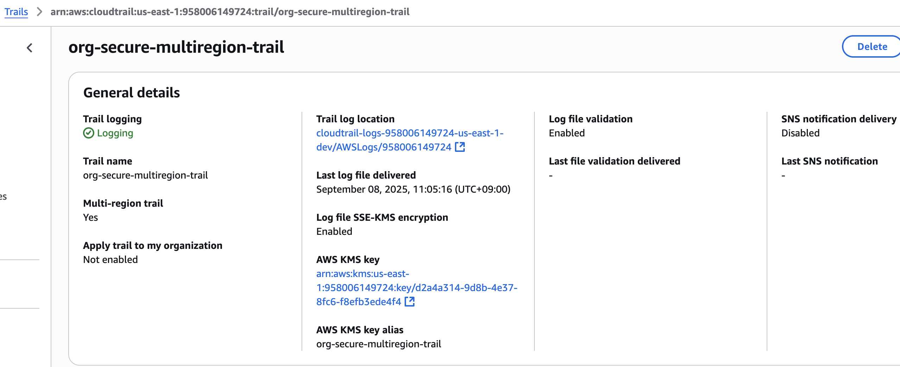
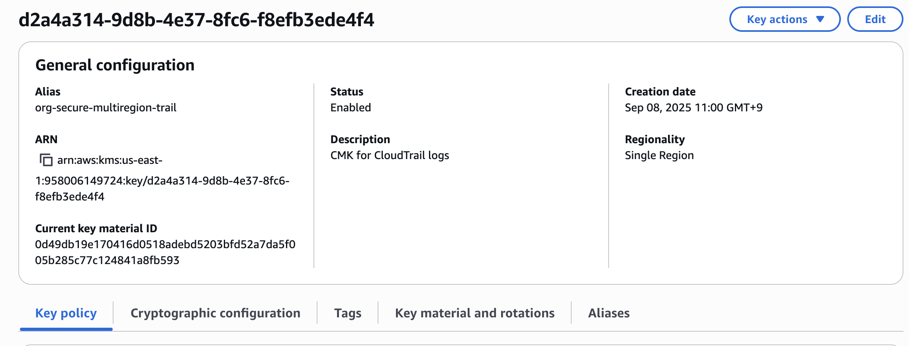
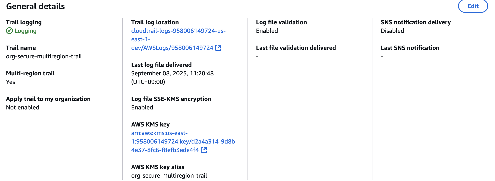
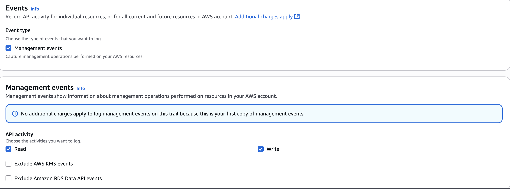
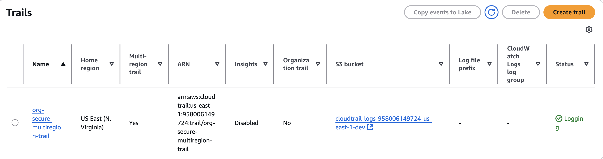
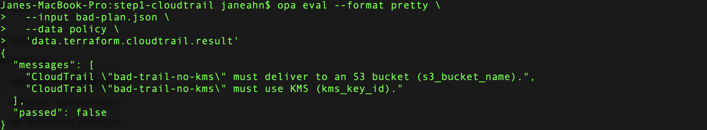
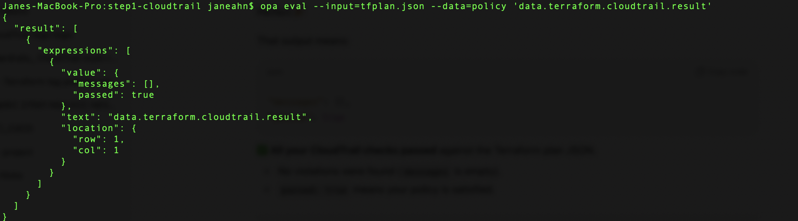

# AWS Security Guardrails — Terraform + Policy-as-Code
---

This repo demonstrates how to implement **preventive AWS security guardrails** using **Terraform and OPA/Rego**.Guardrails enforce best practices like multi-region CloudTrail with KMS encryption, root account restrictions, mandatory tagging, and IAM controls.

Each pattern is mapped to compliance frameworks including:

- **ISO/IEC 27001:2022 (Annex A controls)**
- **CIS AWS Foundations Benchmark**
- **Saudi Arabia NCA ECC (Essential Cybersecurity Controls)**
- **UAE NESA IAS (Information Assurance Standards)**

# Step 1 — CloudTrail Guardrail (Multi-Region, KMS-Encrypted)

## What this proves
- I can enforce **organization-wide audit trails** with CloudTrail.
- Trails are **multi-region, encrypted, tamper-proof, and immutable**.
- Centralized logs enable **forensic readiness** and **compliance evidence**.

---

## Screenshots

| Proof | Screenshot |
|-------|------------|
| ✅ CloudTrail created (multi-region enabled) |  |
| ✅ KMS CMK for CloudTrail (rotation enabled) |  |
| ✅ Log file validation enabled |  |
| ✅ Global service events included |  |
| ✅ Trail delivering logs to S3 bucket |  |
| ❌ (Negative test) KMS missing → OPA violation |  |
| ✅ (Positive test) All checks passed → OPA result |  |

---

## Compliance Mapping

| Framework | Control ID | Control Description | How this guardrail helps |
|-----------|------------|---------------------|--------------------------|
| **ISO/IEC 27001:2022** | A.8.16 | Monitoring activities | CloudTrail records all API actions across AWS accounts. |
| | A.8.20 | Use of cryptography | KMS CMK enforces encryption for CloudTrail logs. |
| | A.12.4 | Logging and monitoring | CloudTrail provides auditable, tamper-proof log evidence. |
| **Saudi Arabia — NCA ECC** | MON-01 | Audit logging | Multi-region CloudTrail ensures complete activity logging. |
| | CRY-04 | Encryption of sensitive data | Logs are encrypted with KMS CMK. |
| **UAE — NESA IAS** | LOG-05 | Centralized log collection | Centralized CloudTrail logs support incident response. |
| | CRY-06 | Protection of stored logs | CloudTrail logs are encrypted, validated, and immutable. |

---

## Notes
- **Terraform**: Trail configured with `is_multi_region_trail = true`, `kms_key_id`, and `enable_log_file_validation = true`.
- **OPA Policy**: Denies plans where CloudTrail is not multi-region, lacks KMS encryption, or has log file validation disabled.
- **Evidence**: See screenshots + OPA evaluation results in this folder.
